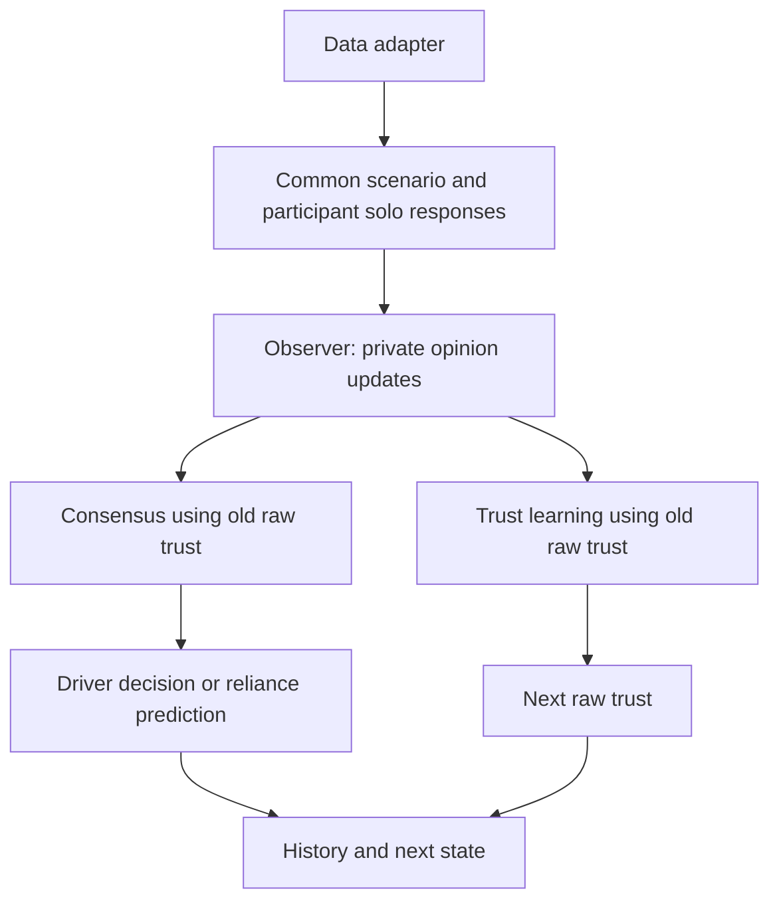

# Architecture for combining solo-driver records with social trust

Status: proposed architecture, not an implemented simulator or fitted model.
The initial outcome of interest is the driver's reliance on automation and how
it changes when other occupants are present. Vehicle steering, braking, and
trajectory prediction are outside this first version.

**Updated after reviewing Sibi's comparison note:** use his individual cognitive
and decision model as the preferred baseline when its implementation and fitted
parameters are available. See [Sibi model integration](sibi-integration.md) for
the revised interface and update order. The replay observer described below
remains an optional fallback and a data-checking tool. The 37-participant study
below and the 16-participant hybrid-model paper must not be treated as one dataset
without confirmation.

## 1. What the supplied paper supports

Source: Jeevanandam, Tabango, Wang, and Jain, *Multi-factor cognitive analysis
of human interaction with a conditionally automated vehicle*, Transportation
Research Part F 117 (2026), 103469, DOI: 10.1016/j.trf.2025.103469.
Reviewed local copy: `/Users/aslan/Downloads/1-s2.0-S1369847825004243-main.pdf`.

The paper reports 37 participants: 20 experienced Drive A and 17 Drive B, with
one drive per participant (Section 2.3, p. 8). The four manipulated conditions
are automation transparency, reliability, availability, and task complexity
(Table 2 and Section 2.1, pp. 4-6). Conditions change along a continuous drive;
the study is not a sequence of independent trials.

Self-reports measure automation trust, workload, confidence in manual driving,
risk likelihood, and risk severity, on 0-100 scales in increments of five
(Section 2.1.3 and Table 3, pp. 6-7). Reports are solicited at selected
intersections, not at every telemetry sample. The report at the end of the
practice drive is the baseline for the main drive (Sections 2.4 and 3.3).

Behavioral measurements include automation engagement, user-initiated takeovers,
return of control, and gaze. The paper explicitly says vehicle dynamic inputs
such as steering, acceleration, and braking were not used for its behavioral
analysis; do not assume those channels will be supplied (Section 2.1.3, p. 6).
Reliance is the fraction of time in automatic mode between treatments (Section
3.1, p. 9). Automation availability and engagement are separate variables.

Some HR, GSR, and gaze measurements are missing, and fNIRS was not analyzed
(Section 3.2, p. 10). The 2 Hz logging mentioned in the paper concerns object
poses for gaze matching; it is not a universal sampling rate for the dataset.
Data availability is listed as confidential (p. 17); actual file schemas,
participant identifiers, timing conventions, and available channels remain unknown.

The paper provides experimental evidence and a statistical reliance model,
not a calibrated dynamic model for every participant. Its LME model uses
participant-centered cognitive measures and excludes the later TOR-dominated
periods (Section 3.3, pp. 10-11; Table 7, p. 14). Its coefficients should not be
copied into a probability-of-takeover rule or treated as causal social effects.

## 2. Keep four concepts distinct

| Concept | Simulation representation | Relationship to the data |
| --- | --- | --- |
| Trust in automation | Existing `opinion_vector[i]`, in [-1, 1] | A proposed rescaling of automation-trust reports: `report / 50 - 1` |
| Trust in another occupant's judgment | Raw `trust_matrix[i, j]`, i != j | Social parameter; not measured by this solo-driver experiment |
| Trust in one's own judgment in the discussion | Existing `trust_matrix[i, i]` | The current self-appraisal rule; not automatically measured by driving confidence |
| Confidence in manual driving ability | Separate optional `driving_confidence[i]`, in [0, 1] | Rescale the corresponding 0-100 report by dividing by 100 |

The same explicit 0-100 conversion can be used for workload and the two risk
measures, while retaining the raw values and source scales. Pre-experiment
questionnaires have different items and scales: they require their own documented
scoring. Do not apply the self-report conversion to them automatically.

Do not initialize the social self-trust diagonal from manual-driving confidence
without making and testing an additional modeling assumption. The paper's
discussion reports no significant changes in manual-driving self-confidence;
that does not establish a rule for confidence in one's social judgments.

## 3. Minimal module boundaries

Keep the existing package and its consensus/trust mathematics. Add the data
boundary and orchestration without a large class hierarchy:

```text
av_social_trust/
    car/             # Existing population and directed social graph builder
    consensus.py     # Existing opinion influence: one step at a time
    trust.py         # Existing interpersonal and social self-trust updates
    data.py          # Canonical records and source interface
    observer.py      # Participant baseline response -> private opinion evidence
    decision.py      # Driver cognition -> automation-use decision/prediction
    model.py         # Clock, state, update ordering, and history
    adapters/
        synthetic.py # Clearly synthetic profiles and scenarios now
        sibi.py      # File translation after the real schema is available
```

`observer.py` is the scientific bridge. Adapters translate file names, columns,
units, and timestamps; they do not implement social behavior. No consensus or
trust function should know about a CSV filename, iMotions export, or Sibi-specific
column name. Start `data.py` with a few dataclasses and a source protocol; avoid
dataframe-library dependencies until a real adapter needs one.

There is currently an empty `observe.py` and an empty `model.py`. Use the name
`observer.py` when implementing this proposal. The existing `Car` remains the
configuration builder. `model.py` owns one independent state exported by
`Car.to_state()`; do not keep the graph and an independently mutable simulation
dictionary as competing sources of truth.

## 4. Stable data contracts

These are internal names to design around, not claims about the eventual export.

| Record | Core fields | Purpose |
| --- | --- | --- |
| `ParticipantProfile` | `participant_id`, `drive_id`, initial cognitive values, optional response-model parameters, provenance | The same person can be assigned to either role |
| `ScenarioFrame` | `scenario_id`, sequence/segment ID, optional timestamp/duration, transparency, reliability, availability, complexity, optional TOR status | One shared external driving situation for the whole car |
| `SoloMeasurement` | participant/session ID, segment/time, variable, value, original scale, source, quality/missingness | Recorded observations used for fitting, replay, or evaluation |
| `SoloResponse` | participant ID, scenario/segment key, automation-opinion change, optional other cognitive changes, source status | Baseline evidence delivered once to the observer |
| `PrivateUpdate` | agent ID, opinion change, effective observation gain, evidence ID, provenance | What the agent incorporates before social discussion |
| `SimulationState` | existing Car arrays plus profile IDs, time/segment, mode, optional cognitive vectors, observer memory | Current simulated state, separate from recorded measurements |
| `StepResult` | before/private/after-social opinions, old/new raw trust, driver output, source status | Audit trail and later comparison with solo records |

Use explicit `None`/missing flags rather than converting missing data to zero.
Distinguish unknown reliability from reliability being inapplicable while
automation is unavailable. Preserve source timestamps and sample/window
durations when provided. If only treatment-level measurements are available,
advance in treatment segments without fabricating second-by-second values.

Identity must be separate from role and array position:

```text
agent 0 -> participant P07 -> driver
agent 1 -> participant P12 -> passenger
agent 2 -> participant P03 -> passenger
```

P07/P12/P03 are illustrative identifiers. Profiles are reusable immutable inputs;
each simulation gets its own mutable cognitive state and observer memory.

A minimal source interface is:

```python
source.get_profile(participant_id) -> ParticipantProfile
source.iter_scenario(scenario_id) -> Iterable[ScenarioFrame]
source.get_solo_response(participant_id, frame) -> SoloResponse | None
```

Keep measurement access separate from model input access. A recorded trust value
used to construct a replay update is not an independent validation target for that
same update. Future reports, future gaze, and future mode choices must not enter
an online observer. Fitting and held-out prediction should use separate data paths.
In particular, a segment-end report can inform a decision after its timestamp;
using it to predict the already-elapsed segment's reliance is retrospective
association, not a prospective decision model.

## 5. Start with matched-scenario replay

Each occupant is associated with a solo-driver baseline. That is a record of
their response on a particular drive, not a complete policy for all possible
driving situations. For the first experiment:

1. Choose a common Drive A scenario or a common Drive B scenario.
2. Choose participants who experienced that drive.
3. Align them by treatment/route context, preserving treatment history. Do not
   align unrelated records simply because both say `t = 120 seconds`.
4. Use one common scenario frame and one actual vehicle mode for all occupants.
5. Supply each person's matched solo response as private evidence, then apply
   the social model.

Treat passenger responses derived from driver records as a transfer assumption.
Role changes may affect workload, perceived control, and observation. They were
not measured as passenger responses in this study. Likewise, solo records cannot
identify interpersonal trust or its learning rates: those remain controlled
simulation parameters until suitable social data exist.

Even within the same drive and treatment, participants can have different mode
histories and exposure durations. Preserve those conditions with each response.
Only reuse responses with compatible context, use a conditional response model,
or explicitly label transplantation across contexts as an assumption. Matching
treatment IDs alone does not prove that every person saw the same situation.

Do not combine a Drive A-only participant with a Drive B scenario by filling in
unobserved responses silently. Return a missing response, restrict the experiment,
or use an explicitly labeled estimated response model. A later response model
can share the same observer interface while predicting from current context,
prior cognitive state, and history.

## 6. The observer and attention

For a first replay model, let `b_i[k]` be the participant's normalized solo
automation-trust baseline at aligned observation k. The source provides
`delta_i[k] = b_i[k+1] - b_i[k]` when that next observation becomes available.
Use the increment once; do not overwrite the simulated opinion with the recorded
level at every step, because that would erase earlier social influence.

A deliberately simple observer is:

```text
private_opinion_i = clip(current_opinion_i + g_i * delta_i, -1, 1)
```

Here `g_i` is an observation gain. For synthetic agents it can initially be the
existing attention parameter. Lower gain models incorporating less of the driving
evidence; it does not mean stronger trust in other occupants. It also does not
prevent opinion changes caused by conversation.

For recorded solo increments, use gain 1 as the replay reference: those responses
already include whatever attention the participant paid. Applying their measured
attention again could count its effect twice. Changing the gain for a distracted
passenger is an explicit counterfactual assumption, not a measured causal effect.
Keep `recorded_attention` and `simulation_observation_gain` distinguishable if gaze
later becomes available. A gaze-based proxy will need its own validity rules;
less road gaze is not automatically equivalent to phone distraction.

Missing evidence produces no direct increment and is logged as missing. A lack
of a report does not establish that latent trust did not change. Replay is coarse
observation-level driving evidence; a fitted observer may later model changes
between measurements and participant-specific delays.

The identity check is useful: for one occupant with no social interaction,
initial opinion `b_i[0]`, gain 1, and all recorded increments applied exactly once,
the simulated opinions reproduce `b_i[k]`. This is a replay consistency test,
not evidence that the observer predicts unseen data.

## 7. One explicit simulation step



Recommended initial schedule:

1. Read the next common frame and the evidence newly available for each agent.
2. Produce private opinions `x_private` with `observer.py`.
3. Derive `W = normalize_trust_matrix(T_old)`.
4. Apply one or a configured finite number of DeGroot discussion rounds to
   `x_private`, using fixed `W` for those rounds.
5. Call `trust_step(x_private, T_old, ...)` once. Its interpersonal and self-trust
   updates remain synchronous. Using private opinions is an explicit convention
   to avoid learning only from already-complete social agreement.
6. Evaluate the driver's automation-use response using the social opinion and
   any modeled workload/risk/driving-confidence values.
7. Record both intermediate and final values, then commit the next state.

The driver controls actual mode; passengers can express opinions but cannot each
set a separate mode for the shared car. Any passenger's recorded solo mode is a
baseline record, not the mode of the simulated car.

Do not call `run_degroot(..., tol=...)` to full convergence automatically at each
driving sample. Choose a finite discussion budget so driving evidence, social
influence, and trust learning have explicit relative time scales. Social rates
currently mean "per trust update," not "per second." Raw sensor resampling must
not silently increase the number of social updates or reapply one measurement.

## 8. Separate replay from a driving counterfactual

In replay/evaluation mode, keep recorded scenario and mode history fixed. Predict
how the social driver's trust or desired reliance differs, but do not feed a new
mode choice back into a trace whose later observations came from the old mode.
This is a comparison under recorded exposure, not a closed-loop driving outcome.

In a later closed-loop mode, the driver's decision changes actual automation
engagement. A shared environment model must then generate the next exposure
conditional on that choice. Participant response models must also support that
context. Merely replaying the original individual's next report cannot identify
what they would have experienced after a different takeover decision.

`decision.py` keeps this distinction out of `observer.py`. Begin with a documented
placeholder decision rule only if simulated decisions are needed. Calibrate a
rule on individual records later; distinguish a segment-level reliance fraction
from instantaneous switch probability and takeover timing. Confidence in manual
driving, workload, and risk can be optional inputs with explicit missingness.

Availability is an environmental constraint. Mandatory takeovers cannot be
classified as distrust-driven choices. For a segment model, enforce unavailable
automation as manual operation; an event-level model should separately represent
the study's TOR warning and five-second takeover window (Section 2.1, p. 5).

## 9. Implementation and validation sequence

1. Define the records in `data.py` and a synthetic source with three clearly
   synthetic profiles under one common scenario. Preserve provenance and a seed.
2. Implement the incremental replay observer and `model.py` with the explicit
   schedule above. Use the existing consensus and trust functions unchanged.
3. Compare driver-alone and passenger-group runs with matched scenario, profiles,
   and random draws. Log the contributions of private evidence and social mixing.
4. When data arrives, implement only the export translation in `adapters/sibi.py`
   for replay. New scientific response or decision models, if required, are
   separate work; changing an adapter cannot solve missing counterfactual data.

Acceptance checks for the first implementation:

- Synthetic and recorded adapters produce the same types, scales, and ordering.
- Solo replay with unit gain reproduces the baseline at observed points.
- No-social and zero-evidence cases have the expected independent behavior.
- Attention zero blocks private evidence but still permits social influence.
- A measurement is not applied twice when simulation sampling becomes finer.
- Missing reports and unsupported Drive A/B combinations are visible.
- Manual-driving confidence never overwrites the social self-trust diagonal.
- A zero-trust connection and an absent connection keep their existing semantics.
- Only the driver controls shared mode, and forced/manual periods respect availability.
- Fitting is split by participant/drive; held-out targets and full-drive statistics
  are not fed into an online observer before their timestamps.

## 10. Information needed when the dataset becomes available

Request a data dictionary and a small example export covering participant/session
IDs, Drive A/B assignment, treatment/intersection markers, timestamp units and
clock alignment, automation availability and mode, switch/TOR cause codes,
self-reports with exact timing/scales, and missing/quality flags. Ask whether
raw streams, treatment aggregates, or both are available, and whether treatment
history includes the practice drive and report pauses.

Gaze/AOI data and processed physiological measures are optional later additions.
Do not require them to run the minimal model. Ask separately whether any fitted
participant-level dynamic or reliance models accompany the records; the paper
alone does not supply them.

No automatic correspondence to the original IDETC equations is claimed here:
this architecture is based on the current repository's agreed consensus and
trust rules. The IDETC formulation can later be checked or substituted inside
those modules without changing the data contracts.
